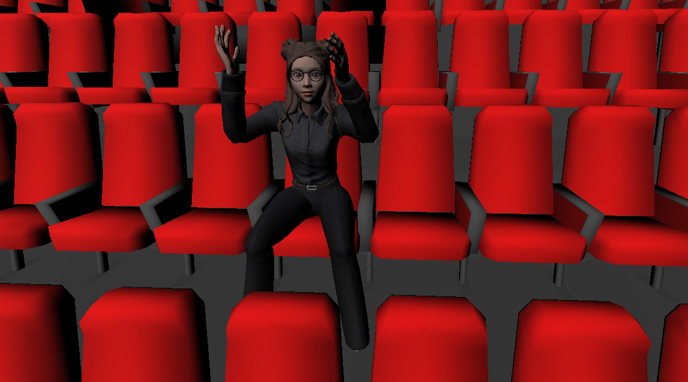

# WE-ARE

(In-Progress)

WE-ARE is a social application which will allow people to meet in virtual reality. An attractive feature of this mobile application is that it will allow people to use the social application in 2d mode and then whenever the user wants to shift to a virtual reality environment with another user, he can easily do that with a simple click. 

This application will allow users to do the following in VR mode:

    1) Watch movies
    2) Play games
    3) Enjoy immersive 3d virtual reality environment (Converse with other users in the environment)
    4) Voice Communication
    5) Reactions

    And much more!

## Demo

Here is a demo of 2 users enjoying a movie in our virtual cinema

## Screenshots

Login -

Profile -

Edit Avatar -

Friends Menu -

Create Room -

VR Cinema -

## Support

For support, email muhammadbassam73@gmail.com.

